# Parcial Desarrollo de Software 

El fin de esta API es resolver el siguiente problema que se nos plantea: 

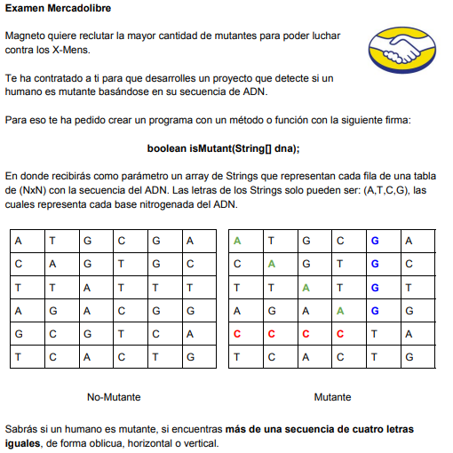

Y tenemos distintos niveles para cumplir con los requerimientos que necesita la API

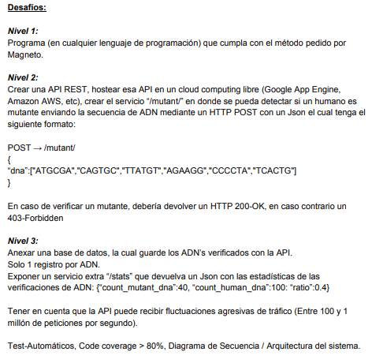

1. En este caso estamos utilizando Java con Spring 

2. Nos piden dos servicios "/mutant" y "/stats" que a continuación veremos su funcionamiento. Como bonus me gustó implementar otro servicio "/generateDNA" que basicamente genera una secuencia de ADN aleatoria indicandole el tamaño y si deseas que sea mutante o no

3. El proyecto cuenta con test unitarios para el correcto funcionamiento y validacion de las secuencias de ADN

# Mapa del repositorio 
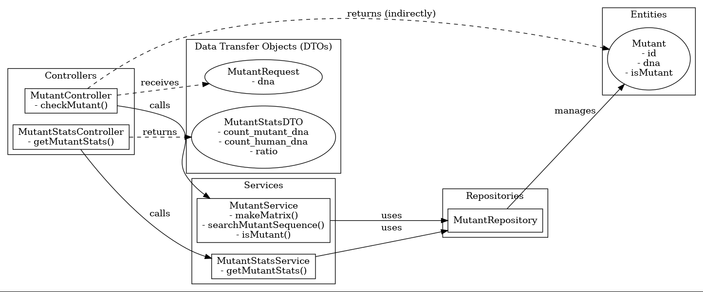

### Diagrama de secuencia para la operacion GET "/stats"

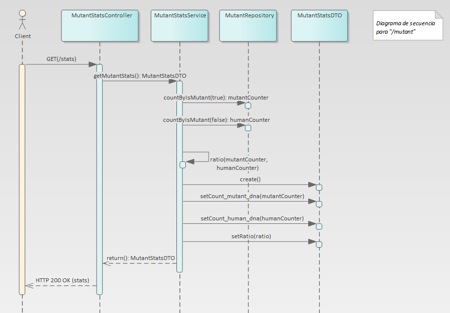

### Diagrama de secuencia para la operacion POST "/mutant"

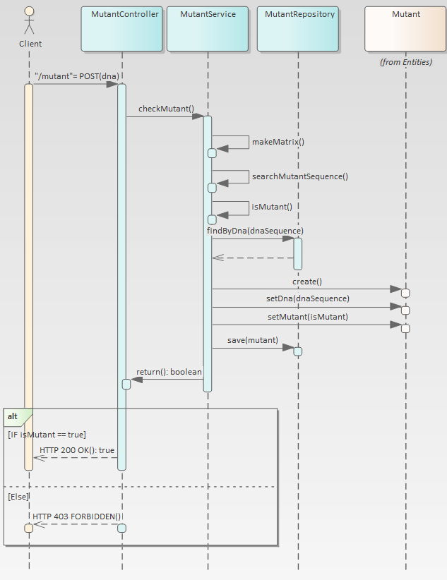

## Prueba de la API swagger en local Host

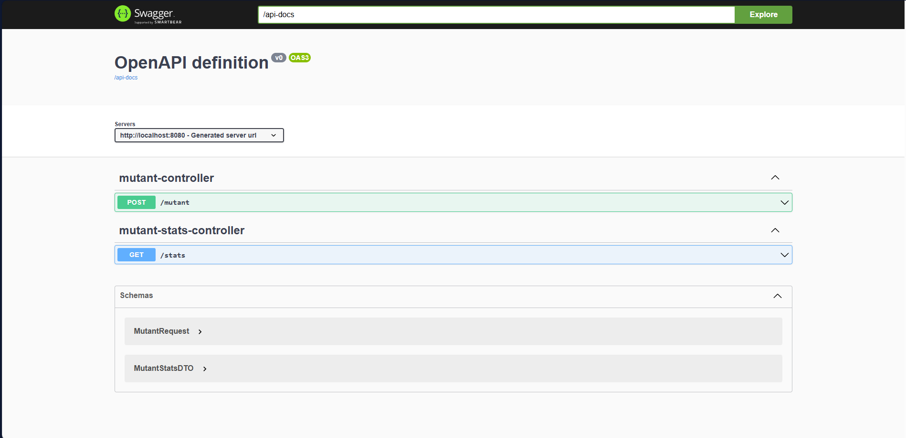

### Prueba del servicio "/mutant"

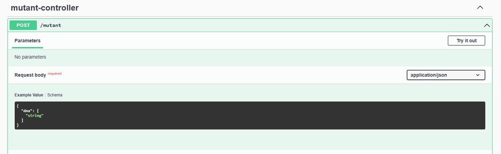
#### Post para cadena que de una respuesta HTTP 200 OK  
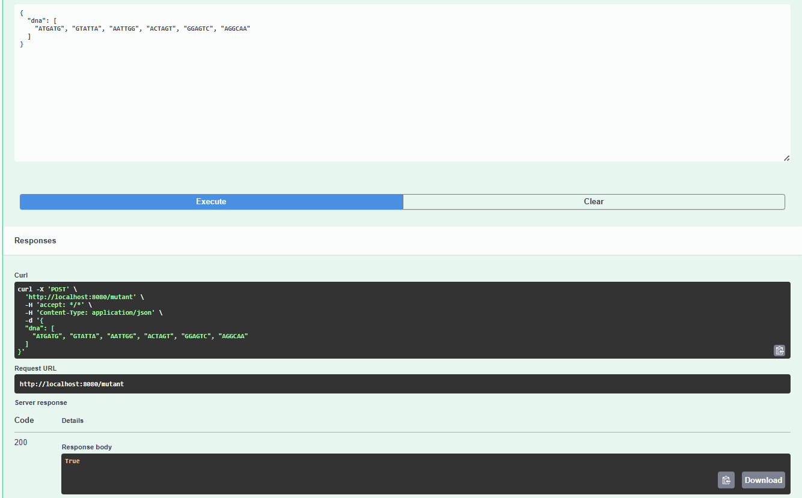
#### Post para cadena que de una respuesta HTTP 403 FORBIDDEN
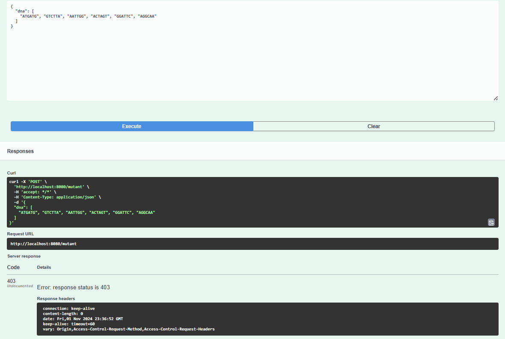
### Prueba del servicio "/stats"

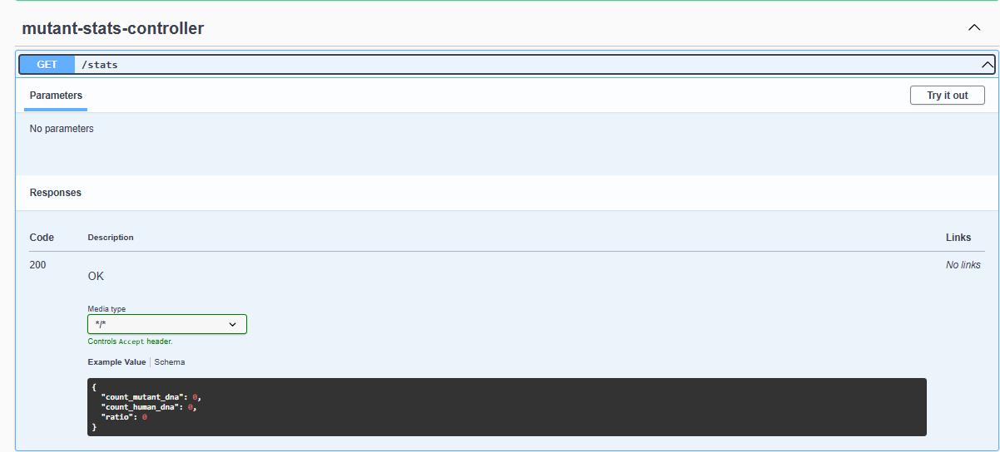
#### Prueba del GET
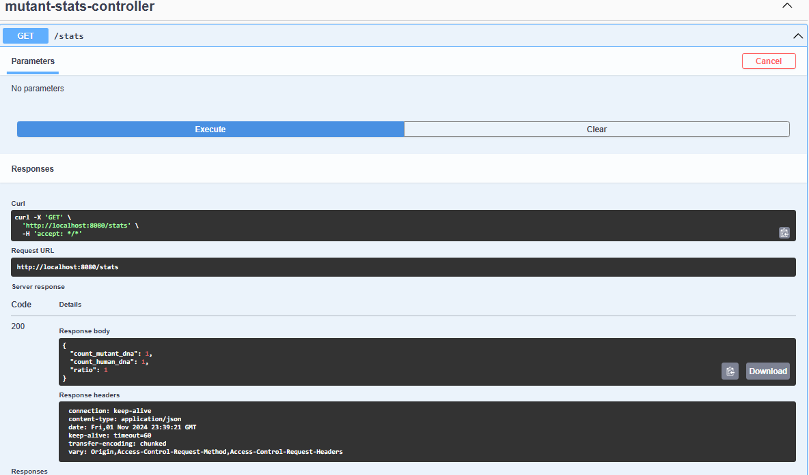

### Prueba del servicio "/generateDNA"

## Base de datos H2 en memoria

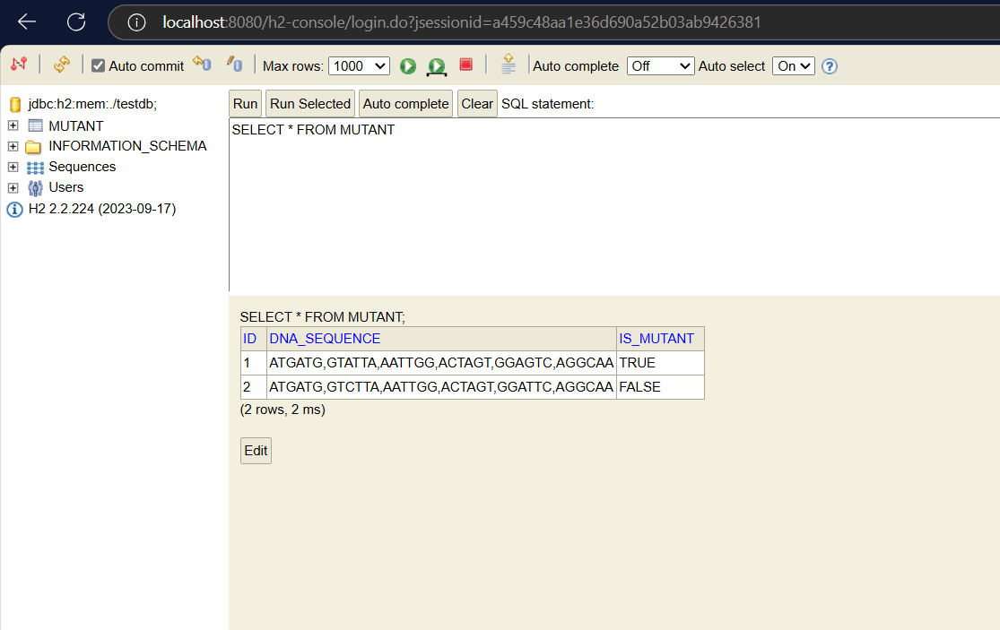

## Covertura del código

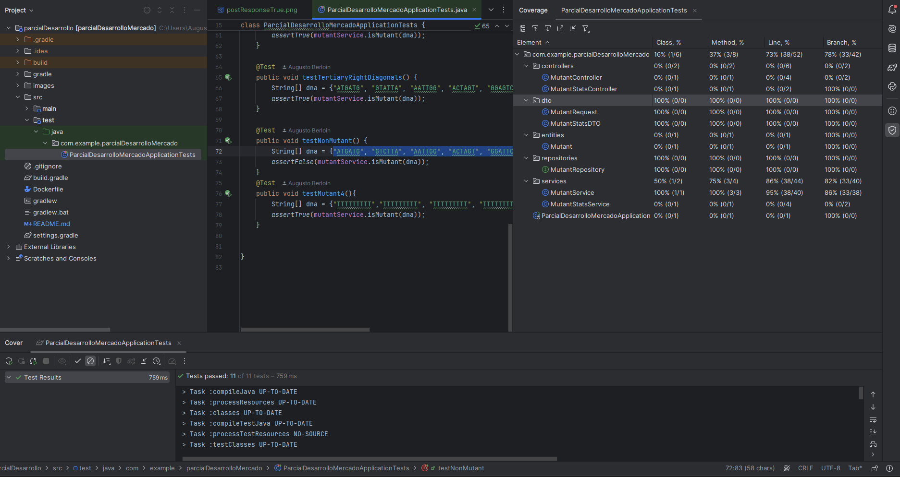