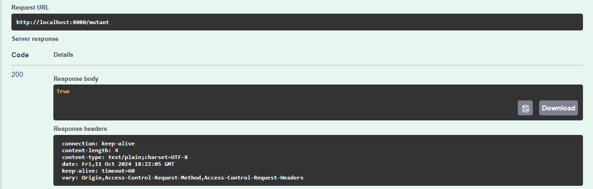
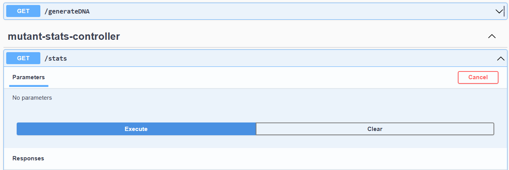

# Parcial Desarrollo de Software 

El fin de esta API es resolver el siguiente problema que se nos plantea: 

Y tenemos distintos niveles para cumplir con los requerimientos que necesita la API

1. En este caso estamos utilizando Java con Spring 

2. Nos piden dos servicios "/mutant" y "/stats" que a continuación veremos su funcionamiento. Como bonus me gustó implementar otro servicio "/generateDNA" que basicamente genera una secuencia de ADN aleatoria indicandole el tamaño y si deseas que sea mutante o no

3. El proyecto cuenta con test unitarios para el correcto funcionamiento y validacion de las secuencias de ADN

4.
## Prueba de la API swagger en local Host

### Prueba del servicio "/mutant"

### Prueba del servicio "/stats"

### Prueba del servicio "/generateDNA"

## Base de datos H2 en memoria 

